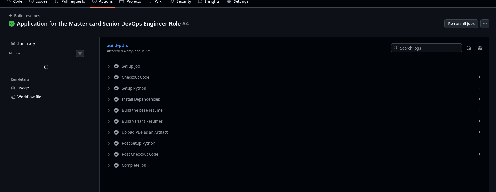
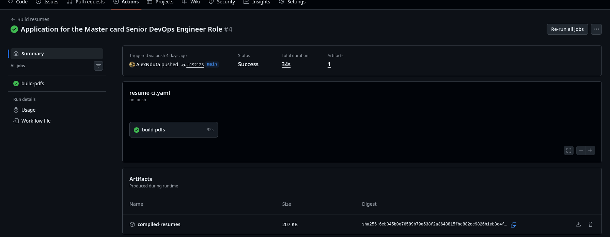
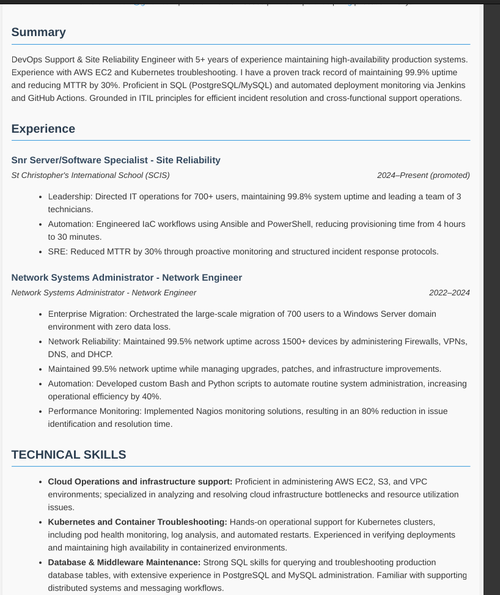

This is a fantastic start. To make this README look like it was written by a **Senior DevOps Engineer**, we should emphasize the **engineering principles** behind it (Everything-as-Code, Single Source of Truth, and CI/CD).

Here is a professionally refactored version of your README. It fixes the typos (e.g., "HTLM," "pilex," "dis") and adds a "Why" section that highlights your DevOps mindset to recruiters.

---

#  Resume-as-Code: Automated Career Pipeline

##  Overview

The core philosophy of this project is **Everything-as-Code**. Instead of treating a CV as a static document, this project treats it as a software product. By decoupling professional data from the visual presentation, I can automate the generation of tailored, ATS-optimized resumes using modern DevOps tooling.

**Why this matters:**

* **Single Source of Truth:** All career data lives in one YAML file.
* **Toil Reduction:** No more manual formatting in Word or Google Docs.
* **Automated Tailoring:** Generate job-specific variants in seconds using "overlays."
* **Proven Competence:** The resume itself is proof of my CI/CD and automation skills.

##  Architecture

1. **Data Layer (`YAML`)**: Professional history, metrics, and certifications are stored as structured data.
2. **Logic Layer (`Python/Jinja2`)**: A build engine injects the data into a semantic HTML5 template.
3. **Automation Layer (`GitHub Actions`)**: A CI/CD pipeline triggers on every push, spins up a headless Chromium browser via **Playwright**, and renders a pixel-perfect PDF.

##  Project Structure

```bash
├── .github/workflows/ # CI/CD pipeline definitions
├── data/              # Single Source of Truth (resume.yaml)
├── src/               # Python build engine (build.py)
├── templates/         # Jinja2 HTML templates & CSS
├── variants/          # Job-specific YAML overrides (e.g., mastercard.yaml)
└── dist/              # Generated PDF output (git-ignored)

```

##  Setup & Usage

### 1. Tailoring Your Resume

To tailor your resume for a specific role (e.g., a "Safaricom" variant):

1. Create `variants/safaricom.yaml`.
2. Only include the fields you wish to override (e.g., a specific summary or highlighted bullet points).
3. The build script will merge your variant with the base data automatically.

### 2. Local Development

Ensure you have Python 3.9+ installed.

```sh
# Install dependencies
$ pip install -r requirements.txt

# Install the headless browser engine
$ playwright install chromium

# Build the base resume
$ python3 src/build.py

# Build a specific variant
$ python3 src/build.py variants/safaricom.yaml

```

### 3. Automated Deployment

This project is designed for a **GitOps** workflow.

```sh
$ git add .
$ git commit -m "feat: added AWS Solutions Architect certification"
$ git push

```

Once pushed, GitHub Actions validates the YAML schema, renders the PDF, and uploads the final document as an **Action Artifact**.

## Tech Stack

* **Data**: YAML
* **Templating**: Jinja2 / HTML5 / CSS3
* **Engine**: Python 3 / Playwright (Headless Chromium)
* **CI/CD**: GitHub Actions

## ATS Optimization

The output PDF is engineered for **Applicant Tracking Systems**:

* **Semantic HTML**: Uses standard `<header>`, `<section>`, and `<ul>` tags for clear parsing.
* **Standard Fonts**: Relies on Arial/Sans-Serif for universal readability.
* **Zero Tables**: Avoids complex layouts that break traditional ATS parsers.


# The build process


# The artiifact output


# CV ouput sample

